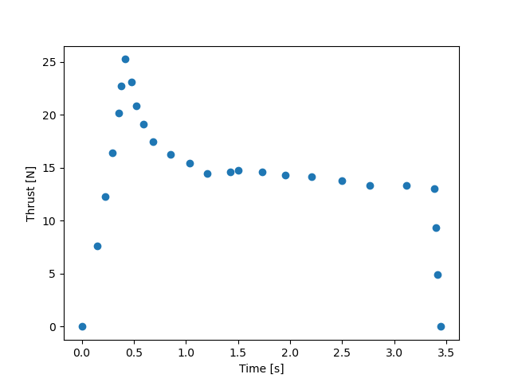
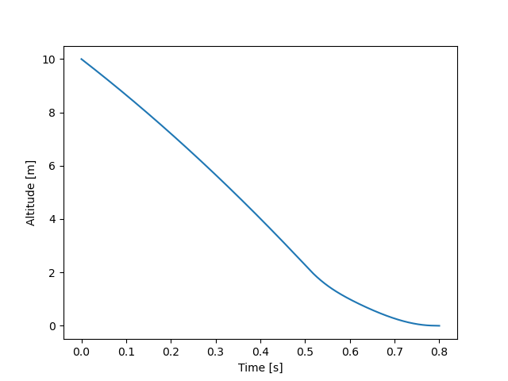
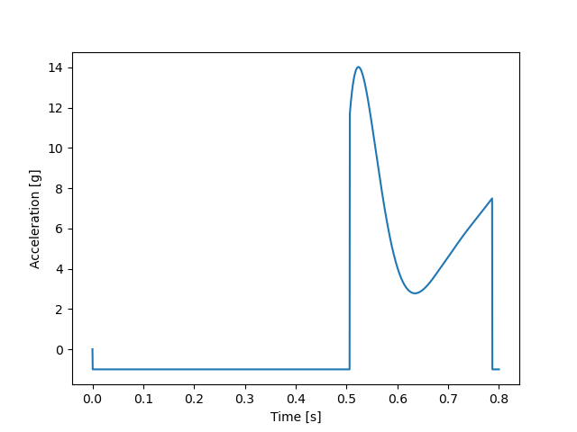

# propulsive_landing
DARE Control Research Group project on propulsive landing of student built and model rockets

## General Information

This Github provides a loose codebase for a standalone DARE Control Research Group project on propulsive landing of student built and model rockets relying on Solid Rocket Motors (SRM) for propulsion. This work was mainly done at the beginning of the academic year 2021-2022, knowledge gathered was then used in the RC Starship and RSA robotic arm project. Main findings of the project are summarised, consisting of findings on PID and reinforcement learning control.

## Main Findings: PID Control 

Readily available SRM data from manufacturers was used to produce simulated thrust curves (see for example https://estesrockets.com/). The thrust curve of the Estes F-15-0 motor can be seen in the picture below. 

Since a SRM cannot be throttled we imagine a mechanism that symmetrically deflects part of the thrust in the plane perpendicular to the thrust vector (e.g thrust vanes). This way we can reduce the amount of thrust delivered in the axial direction and therefore control the vertical length of the burn. To arrive at zero height with zero velocity, we need to find a way to time the beginning of the burn, as well as control the thrust. If either is done incorrectly we might end of either slamming into the ground, or burning out well above the ground, resulting in loss of vehicle. 

We can get estimate the length of the burn trajectory by integrating the motion and thrust of the rocket given a set of initial conditions. We perform this computation at each time step and start our burn when this value equals the rocket altitude plus a small safety margin.

After the burn starts we compute the total impulse received from the SRM and subtract that value from the total impulse contained at t = 0. We subsequently multiply this value by a derivate gain (Kd * dImpulse). Next we subtract the time since the start of the burn from the theoretical total burn time, square it, and multiply it with a control gain. The reasoning behind this term is that when we are close to the start we prefer to have a certain surplus (safety margin) of impulse that we would like to partially bleed off. The figures below show the altitude and acceleration of the simulated rocket. Notice the high accelerations (up to 14g), as well as the near zero derivative at h=0.

 